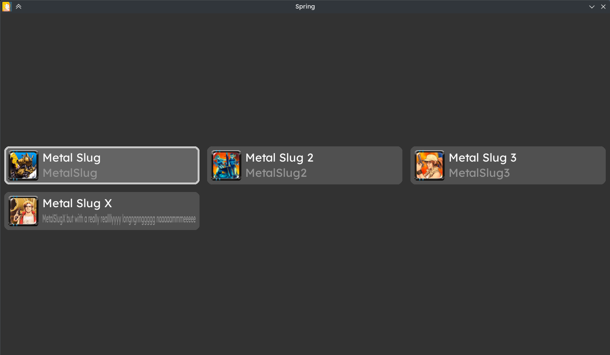
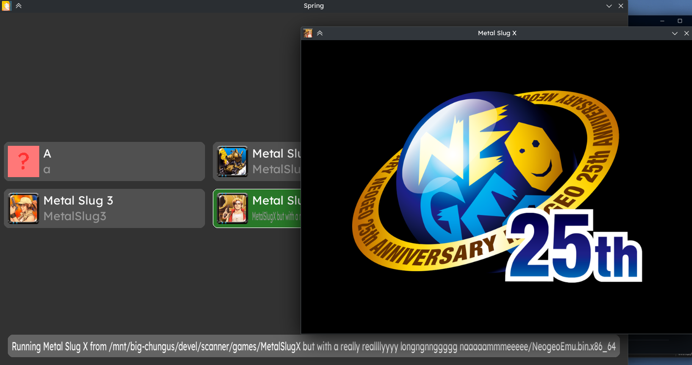

### Spring



A simple Pygame-based app launcher for Linux and Windows. Mostly intended to be used with Heroic Games Launcher for bundling multiple similar games into one entry. (for example, multiple versions of the one game, or patched/modded copies)

It's not designed to be particularly fancy (it just blindly loads things lol), but instead to simply replace my use of [Remote Play Detached](https://github.com/smaTc/RemotePlayDetached) for this with something more automated and responsive. Let me know if you find any bugs!

Supports keyboard (arrows + enter) and mouse.

## Usage



Spring looks for `.exe` files on Windows, and any executable `.sh`, `.x86`, `.x86_64` file or executable files with no extension on Linux. If there are multiple found for a game, it just runs the first one listed at the moment.

Executables are discovered from the `./games/` subdirectory, relative to where Spring itself is. It will be created on first run if it doesn't exist.
For example:
```
- spring
  res/
  - ...
  games/
  - game1/
    - game1.sh or game1.exe
      icon.png
      name.txt
  - game2/
    - game2.x86_64 or game2.exe
      icon.png
      name.txt
  - game3/
    - game3 or game3.exe
      icon.png
      name.txt
```
The `icon.png` and `name.txt` files are used for the UI, and are loaded case-insensitive.
- Icon is loaded and scaled to fit the size of the entries. It can be named `icon` with any extension loadable by Pygame, or be named as part of the dirname (e.g. it can be `game1.png` if located in `./game1-linux/`). If an icon isn't found, a placeholder icon is shown instead.
- Name is a plaintext file whose first line is read and used as the title of the entry. If it doesn't exist, the name defaults to a slightly processed version of the parent directory's name.

### With Heroic (or similar launcher)
- Get Spring. Any of: a binary from Releases, clone the repo and use `spring.py` + `res/`, or build it yourself. Current `main` supports an absolute path argument for the folder to search, when run as `./spring /path/to/games`, otherwise, copy or symlink spring to the folder you want the games to be.
  - Linux: should be able to use `spring.py` directly in place of the binary, as long as Python3 and Pygame are installed and `res/` is in the same directory as `spring.py`.
  - Windows/Wine: `.\spring.exe  C:\path\to\games` and `python.exe .\spring.py C:\path\to\games` seem to work for me.
- Then, go to Edit Game and point its game path to the Spring executable.
- Finally, add the path to the folder containing the games into game arguments on the Game Settings panel, or put the games into `./games/` as described previously.
- Launching the game from the launcher should now launch Spring, and if all goes well you should have some (probably slightly broken-looking) entries on display. Add Icons and Names where necessary.
  - Spring only searches one folder deep, so you may need to make launch scripts for games that are stored in deeper subfolders.

## Running / Building executable

Spring uses `pygame`, which can be installed with `pip install pygame`. Afterwards, you should be able to run it through Python as normal.

Building an executable requires PyInstaller or similar. (PyInstaller is just what I used)

Not quite small note, PyInstaller doesn't support cross-compilation, so ironically you will need either a Windows machine or to run Windows PyInstaller through Wine in order to build Spring for use with Wine.

See [`build.sh`](build.sh) and [`build.bat`](build.bat) for `pyinstaller` commands.

## What?
Hmm, perhaps more specific?

### What does Spring mean?
Honestly, I don't really know. You can use springs to launch stuff, far more simple than a rocket. SPrING is, uh, Simple Pygame... thING? Way better than calling it `launcher thingo` at least.

### What's the icon?
A character I made named Rin. She's a witch. She has no relation to Spring other than now being the icon. I might make a proper icon eventually.

